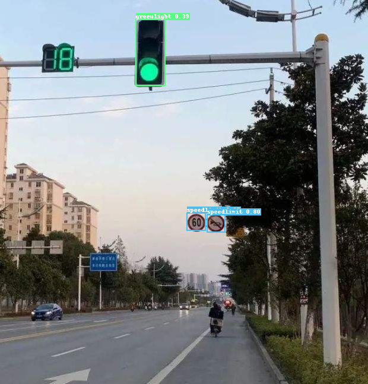
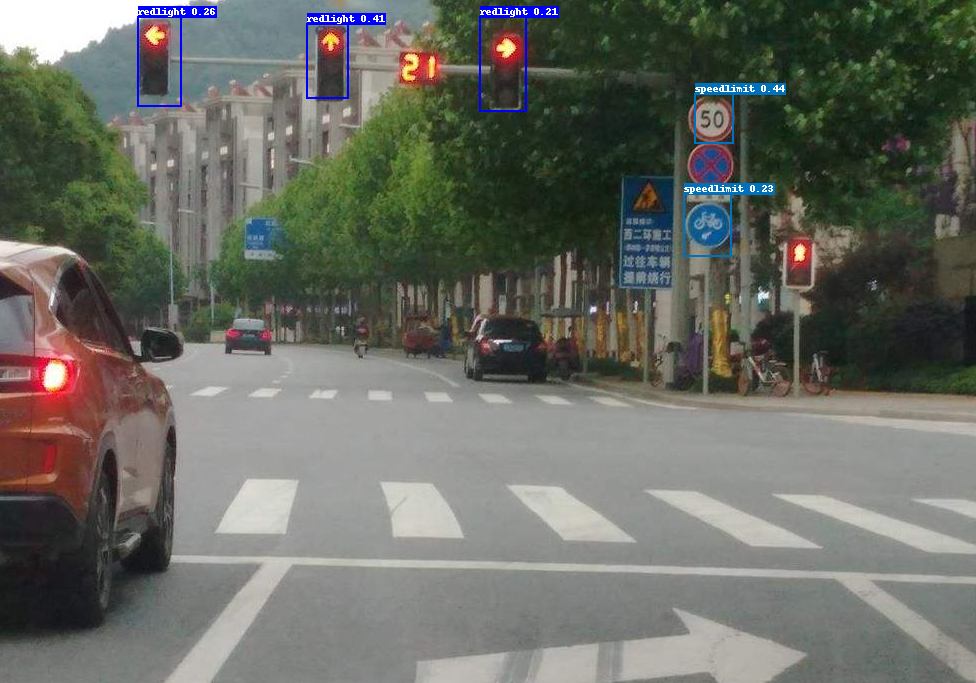

# trafficSignal
## 一、项目背景介绍

yolov3 + mobilenetv1
使用百度[paddledetection](https://github.com/PaddlePaddle/PaddleDetection)原来交通指示牌的基础上，对交通灯增加红，绿，未知三个状态检测



## 二、数据介绍
数据集目录
``` bash
├── annotations
├── download_roadsign_voc.py
├── images
├── label_list.txt
├── train.txt
└── valid.txt
```
### 2.1 数据集下载
> python3 download_roadsign_voc.py

###  2.2 annotations修改说明
修改label_list.txt文件

>   speedlimit       
>   crosswalk         
>   trafficlight          
>   stop    

修改为


> speedlimit  
> crosswalk 
> <font color=#ff0000>    
> unlight   
> redlight        
> greenlight     
> </font> 
> stop    


``` xml
<annotation>
    <folder>images</folder>
    <filename>road29.png</filename>
    <size>
        <width>400</width>
        <height>267</height>
        <depth>3</depth>
    </size>
    <segmented>0</segmented>
    <object>
        <name>greenlight</name>
        <pose>Unspecified</pose>
        <truncated>0</truncated>
        <occluded>0</occluded>
        <difficult>0</difficult>
        <bndbox>
            <xmin>116</xmin>
            <ymin>45</ymin>
            <xmax>219</xmax>
            <ymax>117</ymax>
        </bndbox>
    </object>
    <object>
        <name>unlight</name>
        <pose>Unspecified</pose>
        <truncated>0</truncated>
        <occluded>0</occluded>
        <difficult>0</difficult>
        <bndbox>
            <xmin>94</xmin>
            <ymin>104</ymin>
            <xmax>191</xmax>
            <ymax>153</ymax>
        </bndbox>
    </object>
</annotation>
```


## 三、模型介绍
使用yolov3_mobilenet_v1
!<>[https://github.com/PaddlePaddle/PaddleDetection/blob/release/2.3/configs/yolov3/README.md]

## 四、模型训练环境及参数设置
### 4.1 环境
```
Paddle version: 2.1.3
Paddle With CUDA: True

OS: Ubuntu 20.04
Python version: 3.8.10

CUDA version: 11.2.152
Build cuda_11.2.r11.2/compiler.29618528_0
cuDNN version: None.None.None
Nvidia driver version: 460.91.03
```
### 4.2 参数设置
PaddleDetection/configs/datasets/roadsign_voc.yml
PaddleDetection/configs/yolov3/yolov3_mobilenet_v1_roadsign.yml

``` yml
... 
epoch: 40
use_gpu: true
target_size: [608, 608]
batch_size: 8
num_classes: 6  
... 


```
## 四、模型训练
PaddleDetection$ python3 tools/train.py -c configs/yolov3/yolov3_mobilenet_v1_roadsign.yml

``` log
Warning: import ppdet from source directory without installing, run 'python setup.py install' to install ppdet firstly
[02/22 20:09:41] ppdet.utils.download WARNING: Config annotation dataset/roadsign_voc/train.txt is not a file, dataset config is not valid
[02/22 20:09:41] ppdet.utils.download INFO: Dataset /home/aistudio/work/PaddleDetection/dataset/roadsign_voc is not valid for reason above, try searching /home/aistudio/.cache/paddle/dataset or downloading dataset...
[02/22 20:09:41] ppdet.utils.download INFO: Found /home/aistudio/.cache/paddle/dataset/roadsign_voc/annotations
[02/22 20:09:41] ppdet.utils.download INFO: Found /home/aistudio/.cache/paddle/dataset/roadsign_voc/images
[02/22 20:09:41] reader WARNING: Shared memory size is less than 1G, disable shared_memory in DataLoader
[02/22 20:09:44] ppdet.utils.checkpoint INFO: The shape [255] in pretrained weight yolo_head.yolo_output.0.bias is unmatched with the shape [27] in model yolo_head.yolo_output.0.bias. And the weight yolo_head.yolo_output.0.bias will not be loaded
[02/22 20:09:44] ppdet.utils.checkpoint INFO: The shape [255, 1024, 1, 1] in pretrained weight yolo_head.yolo_output.0.weight is unmatched with the shape [27, 1024, 1, 1] in model yolo_head.yolo_output.0.weight. And the weight yolo_head.yolo_output.0.weight will not be loaded
[02/22 20:09:44] ppdet.utils.checkpoint INFO: The shape [255] in pretrained weight yolo_head.yolo_output.1.bias is unmatched with the shape [27] in model yolo_head.yolo_output.1.bias. And the weight yolo_head.yolo_output.1.bias will not be loaded
[02/22 20:09:44] ppdet.utils.checkpoint INFO: The shape [255, 512, 1, 1] in pretrained weight yolo_head.yolo_output.1.weight is unmatched with the shape [27, 512, 1, 1] in model yolo_head.yolo_output.1.weight. And the weight yolo_head.yolo_output.1.weight will not be loaded
[02/22 20:09:44] ppdet.utils.checkpoint INFO: The shape [255] in pretrained weight yolo_head.yolo_output.2.bias is unmatched with the shape [27] in model yolo_head.yolo_output.2.bias. And the weight yolo_head.yolo_output.2.bias will not be loaded
[02/22 20:09:44] ppdet.utils.checkpoint INFO: The shape [255, 256, 1, 1] in pretrained weight yolo_head.yolo_output.2.weight is unmatched with the shape [27, 256, 1, 1] in model yolo_head.yolo_output.2.weight. And the weight yolo_head.yolo_output.2.weight will not be loaded
[02/22 20:09:44] ppdet.utils.checkpoint INFO: Finish loading model weights: /home/aistudio/.cache/paddle/weights/yolov3_mobilenet_v1_270e_coco.pdparams
[02/22 20:10:04] ppdet.engine INFO: Epoch: [0] [ 0/87] learning_rate: 0.000033 loss_xy: 3.998905 loss_wh: 3.557050 loss_obj: 15119.754883 loss_cls: 3.645238 loss: 15130.956055 eta: 18:53:12 batch_cost: 19.5381 data_cost: 0.0004 ips: 0.4095 images/s

```
## 五、模型评估
YOLOv3 on Pasacl VOC
| 骨架网络     | 输入尺寸 | 每张GPU图片个数 | 学习率策略 |推理时间(fps)| Box AP | 
| :----------- | :--: | :-----: | :-----: |:------------: |:----: |
| MobileNet-V1 | 608  |    8    |   270e  |      -        |  75.2  | 
| this         | 608  |    8    |   270e  |      -        |  66.21  |
	
python3 tools/eval.py -c configs/yolov3/yolov3_mobilenet_v1_roadsign.yml -o weights=output/yolov3_mobilenet_v1_roadsign/36.pdparams
``` log
YOLOv3
W0225 20:17:48.279434  7482 device_context.cc:447] Please NOTE: device: 0, GPU Compute Capability: 6.1, Driver API Version: 11.4, Runtime API Version: 11.2
W0225 20:17:48.281404  7482 device_context.cc:465] device: 0, cuDNN Version: 8.1.
[02/25 20:17:49] ppdet.utils.checkpoint INFO: Finish loading model weights: output/yolov3_mobilenet_v1_roadsign/36.pdparams
[02/25 20:17:49] ppdet.engine INFO: Eval iter: 0
[02/25 20:17:52] ppdet.engine INFO: Eval iter: 100
[02/25 20:17:55] ppdet.metrics.metrics INFO: Accumulating evaluatation results...
[02/25 20:17:55] ppdet.metrics.metrics INFO: mAP(0.50, integral) = 66.21%
[02/25 20:17:55] ppdet.engine INFO: Total sample number: 176, averge FPS: 27.127044921061024
```

## 六、主要影响因素
数据集合中图片多为国外路灯
路灯的box比较小，颜色特征不明显
容易受光线影响大，会出现红色变白色，绿色变白色

## 七、个人感觉
百度paddledetection提供的模型训练，推理，验证的工具，使用起来很方便，容易上手

